# Сервис решений для бизнеса

## Верхнеуровневое описание

Задача проекта - предоставлять набор сервисов (единоразово и по подписке), помогающих бизнесу: юридическое сопровождение, ведение бухгалтерии, организация доставки. Клиент - представитель определенной компании - получает доступ к сервисам. С другой стороны, компании, сотрудничающие с этим проектом, обслуживают определенные типы заявок и могут управлять полученными заявками.

Заинтересованным лицом, кроме клиента, являются компании, предоставляющие определенный набор услуг, т.е. такой сервис является по своей сути агрегатором, но от клиента (по изначальной идее) не должен требоваться выбор конкретной компании. Для клиента доступен выбор услуги и заказ либо единоразово, либо постоянно (по подписке). Для компании доступен прием и отклонение заявок, просмотр принятых заявок. Администраторам доступно управление заявками, просмотр статусов и доп. средства контроля, необходимые для того, чтобы сервис мог предоставлять гарантии, что заказанная услуга будет оказана.

## Аналоги

profi.ru - Посредник между профессионалами и клиентами. Отличие от текущей идеи в ориентировании на разовые задачи и на частных клиентов.

## Действующие лица

1. Клиент - представитель бизнеса
2. Поставщик - компания, предоставляющая определенный набор услуг
3. Администратор сервиса

## Функциональные требования

1. Управление пользователями
    1. Регистрация клиента
    2. Регистрация поставщика
    3. Авторизация клиента
    4. Авторизация поставщика
2. Управление финансами
    1. Пользователь может пополнять баланс кошелька
    2. Пользователь может выводить средства на свой банковский счет
3. Управление подписками со стороны клиента
    1. Клиент может оформлять подписку на услуги
    2. Клиент может отменять подписку
    3. Клиент может просматривать оформленные заявки
    4. Система уведомляет клиента в том случае, если ни один поставщик не принял заявку в течение определенного времени
4. Управление подписками со стороны поставщика
    1. Поставщик может просматривать заявки тех типов, которые может обрабатывать
    2. Поставщик может принимать заявки
5. Взаимодествие между клиентом и поставщиком
    1. Клиент может создавать заказы в рамках своей подписки
    2. Поставщик получает уведомления о новых заказах и помечать их как принятые в обработку
    3. Клиент и поставщик могут вести диалог
    4. Поставщик и клиент могут помечать их как выполненные
    5. Клиент и поставщик могут пожаловаться на заказ
6. Действия администратора
    1. Администратор может просматривать жалобы
    2. Администратор может связываться с клиентом и поставщиком
    3. Администратор может возвращать часть денег поставщику и клиенту

## Развертывание

Проект будет состоять из 6 микросервисов:
- Auth Service - управление пользователями
- Business Service - управление сервисами, провайдерами и подписками
- Chat Service - обеспечение возможности общения между клиентом и провайдером
- Notification Service - взаимодействие с внешним e-mail сервером
- Payment Service - обеспечение финансовых транзакций
- Frontend Service - сервер для SPA

Для развертывания проекта будет использован небольшой Kubernetes кластер, состоящий из 3 машин. 
Для stateful приложений, таких как PostgreSQL, на четвертой машине будет развернут контейнеризованный NFS-сервер.
Для асинхронного взаимодействия будет развернут RabbitMQ внутри кластера.
В качестве gateway будет использован NGINX Ingress Controller.

Также будет настроен CI/CD с использованием GitHub Actions & Github Container Registry.

## Diagrams

### Use case diagrams

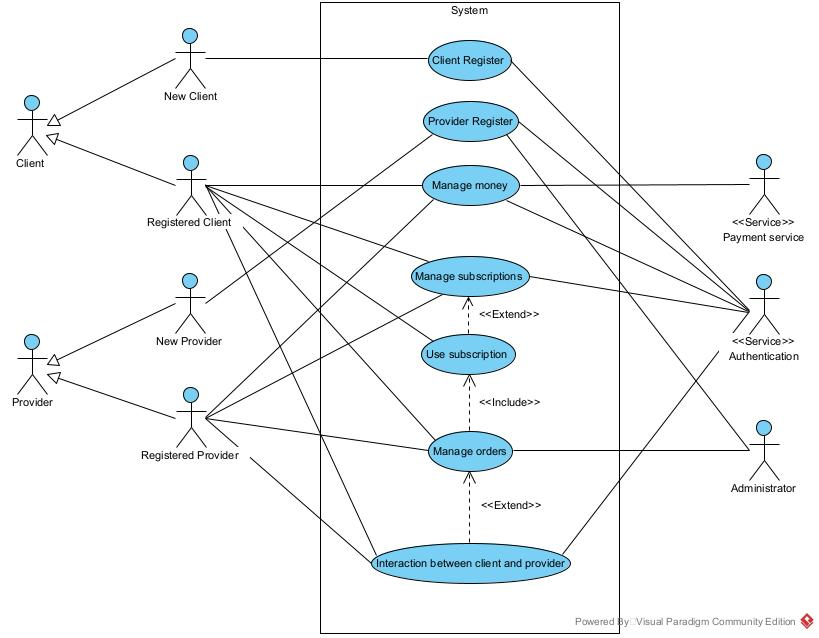

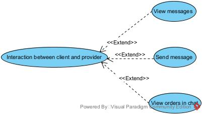

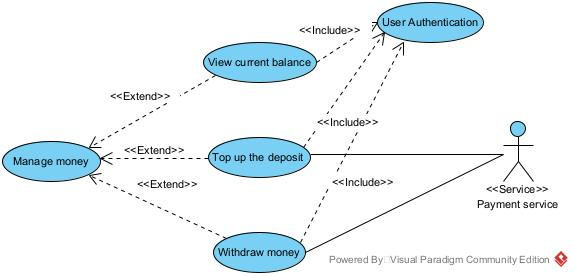

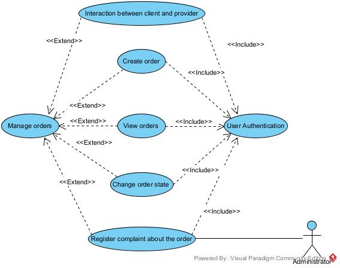

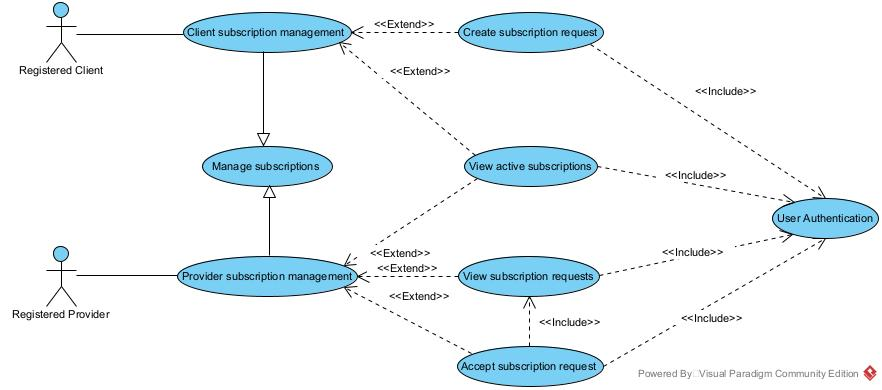

### Activity diagrams

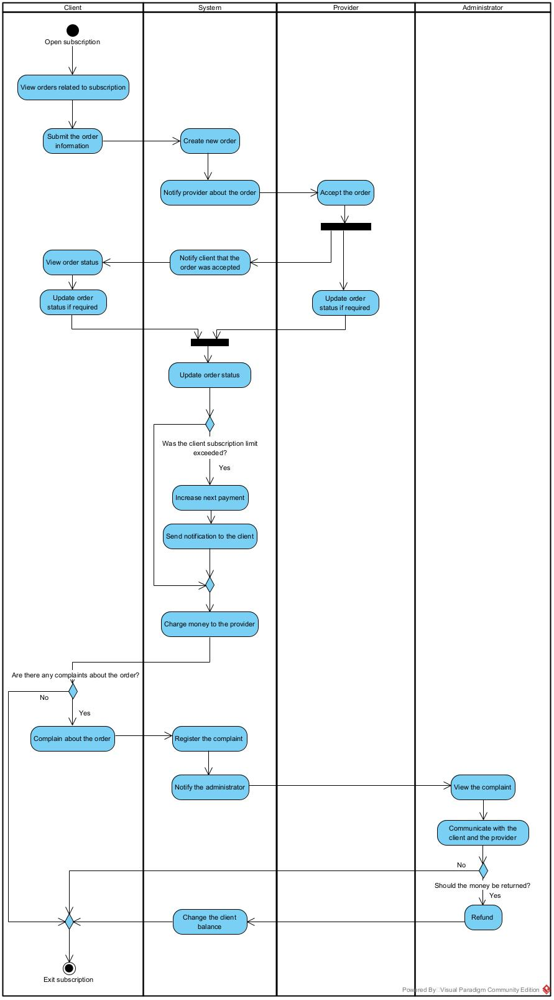

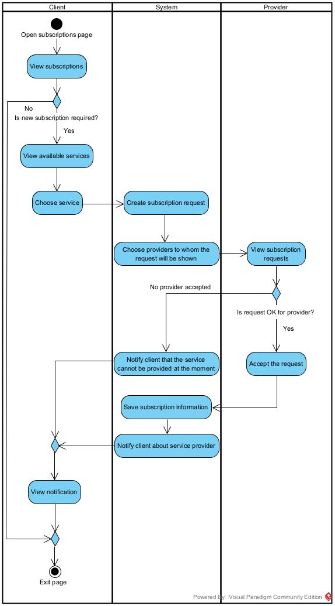

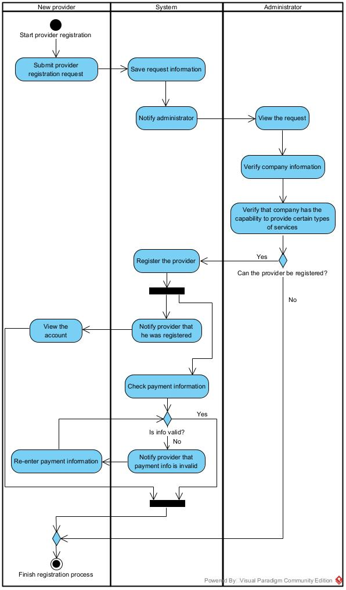

### Class diagrams

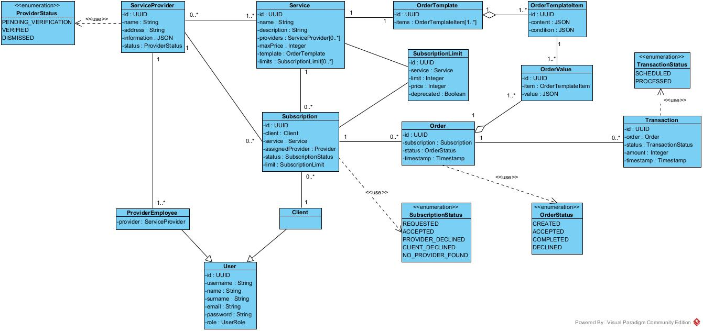

### Deployment diagrams

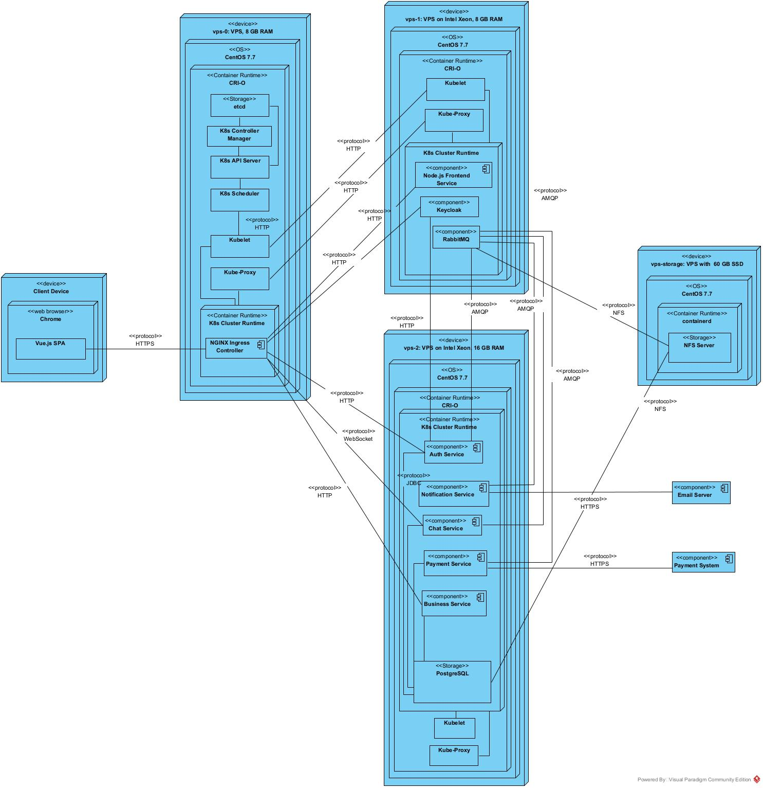

### Sequence diagrams

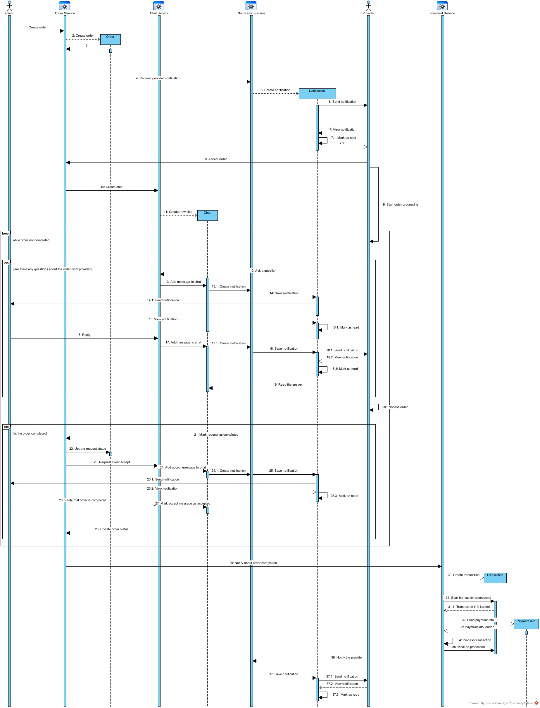

### State diagrams

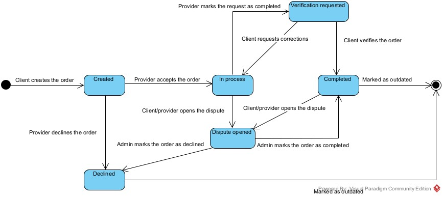

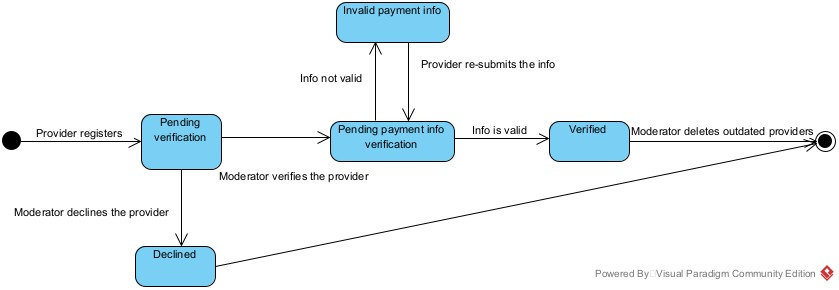

## Screenshots

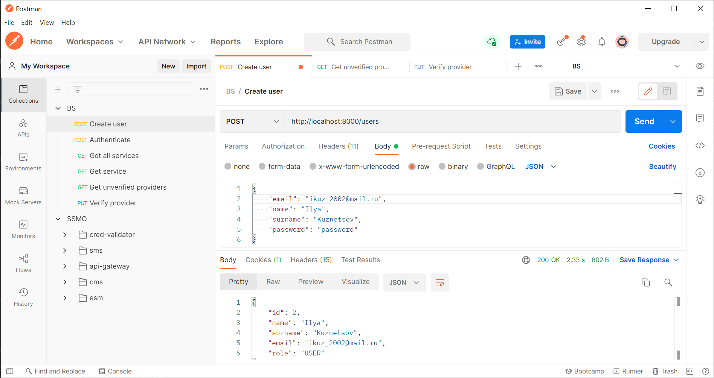

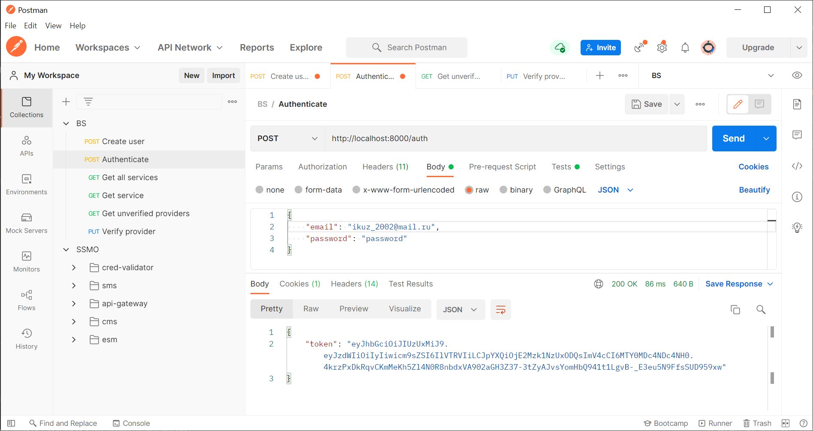

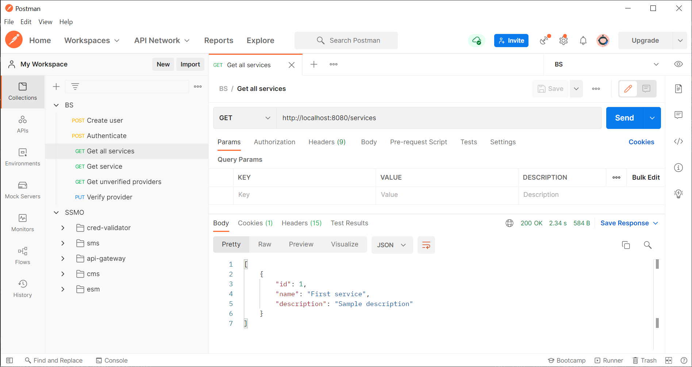

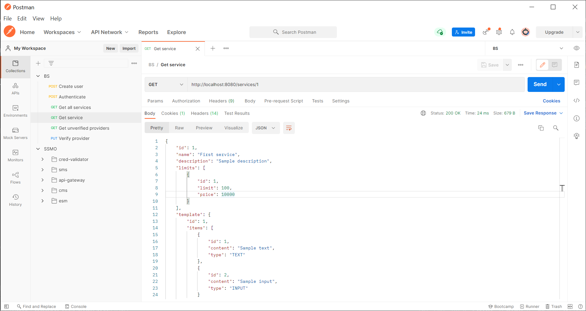

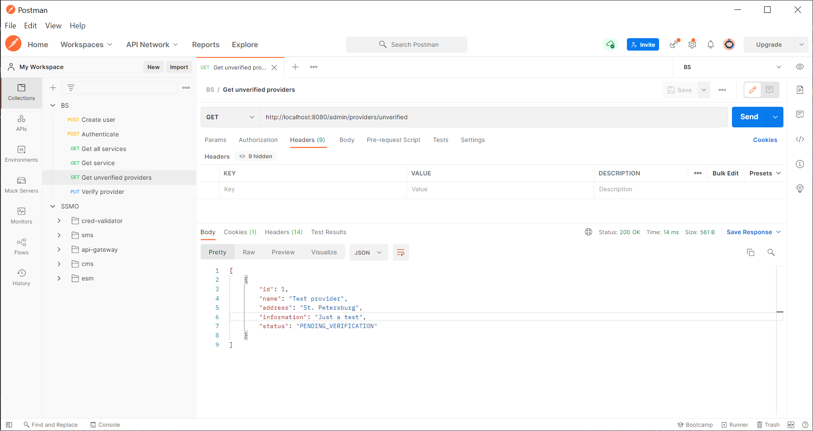

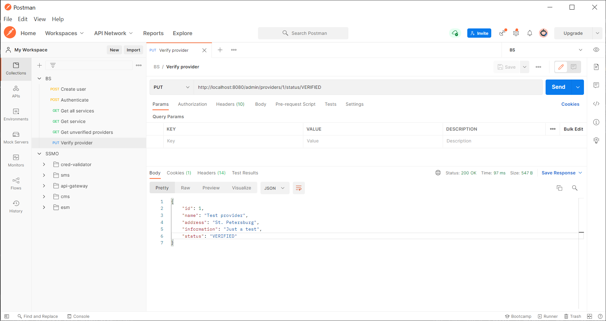

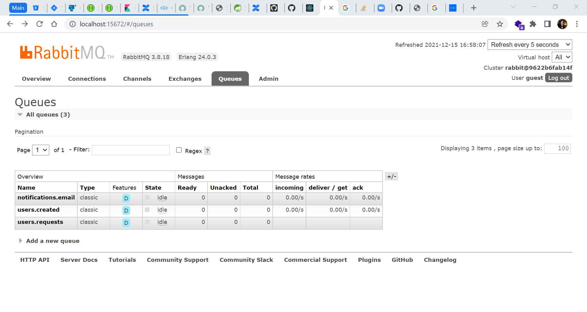

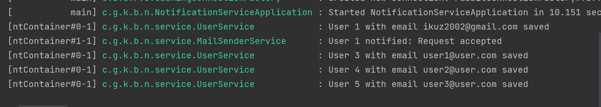
